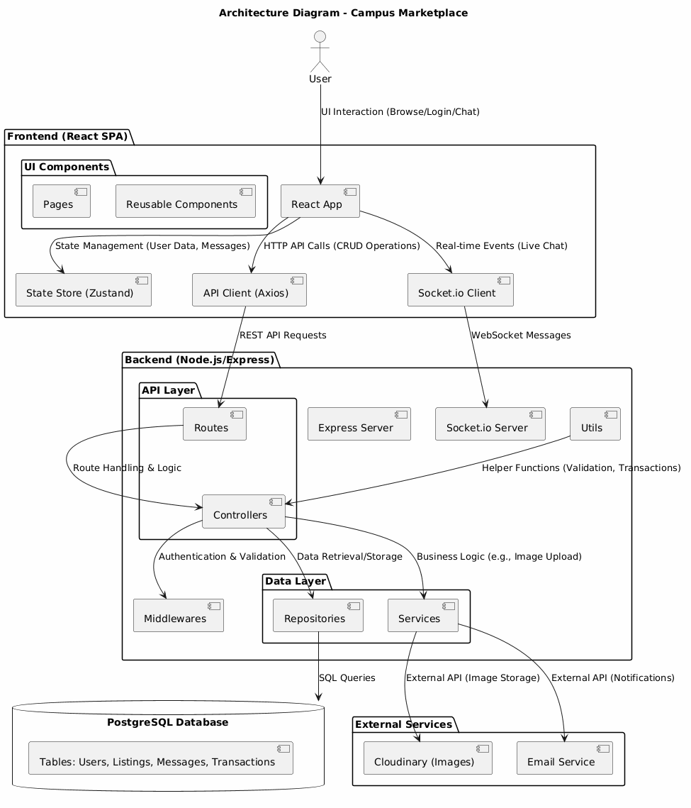
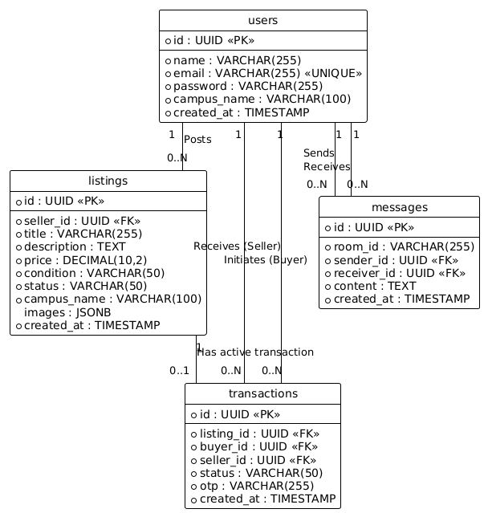
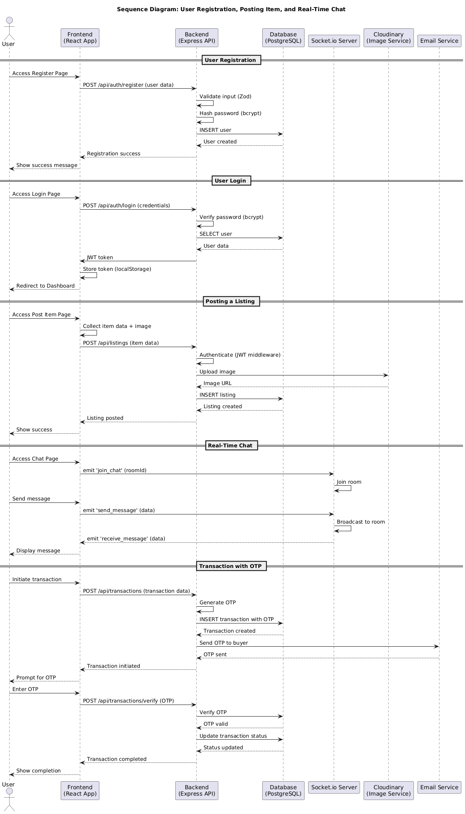

# Campus Marketplace

A secure, real-time, peer‑to‑peer marketplace built exclusively for campus communities.   
Users can buy, sell, and trade items within a closed university network while enjoying live chat, OTP‑verified handovers and campus‑restricted access.

[🔗 Live Demo](https://campus-marketplace-project.vercel.app/)

---

## 📖 Overview
Campus Marketplace addresses the trust and logistical challenges of generic classifieds by limiting participation to a verified campus population.  
The platform fosters quick deals on textbooks, furniture, electronics and more while offering:

* **Instant communication** via WebSocket chat
* **Secure transactions** with OTP and JWT authentication
* **Campus safety** through a vetted user base

The application is divided into a React-based frontend and a Node/Express backend with a PostgreSQL database.  
Connections between components are modular, documented and illustrated with architecture diagrams below.

---

## ✨ Detailed Features

1. **User Management & Authentication**
   * Registration/login with campus ID validation
   * Password hashing using bcrypt
   * Stateless JWT sessions
2. **Listings & Marketplace**
   * Create, read, update, delete listings
   * Image uploads via Cloudinary integration
   * Search and browse by category, price, recency
3. **Real‑Time Chat**
   * Room‑based messaging powered by Socket.io
   * End‑to‑end encrypted payloads (handled client‑side)
   * Global notifications for incoming messages
4. **Transactions & OTP**
   * Buyer–seller agreements tracked in database
   * One‑time passwords sent via email for handover verification
   * Status updates and audit log in transaction records
5. **Resilient Data Layer**
   * PostgreSQL connection pool tuned for serverless (Neon)
   * Schema migrations managed with node‑pg‑migrate
6. **Security & Stability**
   * Helmet, CORS and rate‑limiting middlewares
   * Input validation with Zod schemas
   * Error handling and logging across controllers
7. **Client‑Side State & UX**
   * Central store (Zustand) for auth, socket, UI state
   * Tailwind CSS for responsive layout
   * Toast notifications for user feedback

---

## 🛠️ Technology Stack

### Frontend
* **React** (v19) & **Vite**
* **React Router DOM** for navigation
* **Zustand** for state management
* **Socket.io‑client** for real‑time connectivity
* **Axios** for HTTP requests
* **Tailwind CSS** + **Lucide React** for UI
* **React Hot Toast** for notifications

### Backend
* **Node.js** & **Express.js** (ES modules)
* **Socket.io** for WebSocket server
* **PostgreSQL** (Neon serverless) via `pg` pool
* **node‑pg‑migrate** for migrations
* **JWT** & **bcrypt** for auth
* **Zod** for validation
* **Cloudinary** for image hosting
* **Nodemailer** for emails

### Infrastructure
* Environment variables managed with **dotenv**
* Security headers via **Helmet**
* File uploads handled by **Multer**
* Rate limiting configurable with **express‑rate‑limit**

---

## 🧱 Architecture Diagrams

Visual representations of system structure and flow are available in the **Images/** folder.

*Shows the primary components and their interactions.*

*Database entities and relationships.*

*Typical user workflows across frontend, backend and external services.*

---

## 🔒 Security & Best Practices
* JWT tokens stored securely (httpOnly cookie or local storage).
* Database connections use SSL with `rejectUnauthorized: false` for Neon.
* Input is strictly validated at the edge using Zod schemas.
* API endpoints are guarded by authentication middleware.
