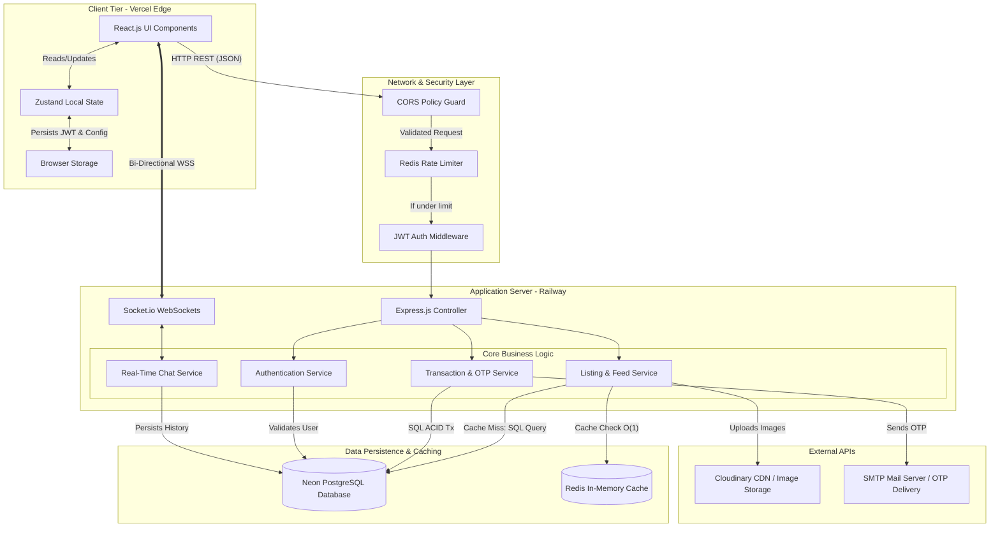

# Campus Marketplace

A secure, high-performance, real-time peer-to-peer marketplace built for campus communities. Users can buy, sell, and trade items within their university network while enjoying live chat, OTP-verified handovers, and enterprise-grade performance.

[Live Demo (Vercel)](https://campus-marketplace-project.vercel.app/)

---

## Overview

Campus Marketplace addresses the trust and logistical challenges of generic classifieds by tailoring the experience for university students. The platform allows users to self-identify their campus and fosters quick deals on textbooks, furniture, electronics, and more while offering instant communication, secure transactions, and a highly optimized data pipeline capable of handling high concurrent traffic.

---

## Detailed Features

**1. User Management & Authentication**
* Flexible registration allowing users to self-identify their campus affiliation.
* Cryptographic password hashing using bcrypt.
* Stateless session management via JWT stored securely in httpOnly cookies.
* Strict rate limiting to prevent brute-force and credential stuffing attacks.

**2. Listings & Marketplace**
* Full CRUD operations for marketplace listings.
* Sub-millisecond latency on feed delivery using a Redis caching layer.
* Advanced filtering and search capabilities (category, price range, condition).
* Secure media handling and image uploads using Cloudinary.
* Automated cache invalidation to ensure users always see real-time availability.

**3. Real-Time Chat System**
* Dedicated room-based messaging powered by Socket.io.
* End-to-end encrypted (E2EE) payloads processed client-side.
* Global WebSocket notifications for out-of-room messaging alerts.

**4. Transactions & Security**
* Buyer-seller agreements are strictly tracked and state-managed in the database.
* One-Time Passwords (OTP) sent via Nodemailer for physical handover verification.
* Parameterized database queries to prevent SQL injection.
* Edge-level payload validation via Zod schemas.

---

## System Architecture



---

## Technology Stack

### Frontend
* **Core:** React (v19), Vite
* **Styling:** Tailwind CSS, UI components with dynamic glassmorphism and modern palettes
* **State Management:** Zustand (with local storage persistence)
* **Networking:** Axios, Socket.io-client
* **Utilities:** React Router DOM, React Hot Toast

### Backend & Infrastructure
* **Runtime:** Node.js, Express.js (ES Modules)
* **Databases:** PostgreSQL (Neon Serverless), Redis (Caching & Rate Limiting)
* **WebSockets:** Socket.io
* **Security:** Helmet, CORS, bcrypt, jsonwebtoken, express-rate-limit
* **Validation:** Zod
* **Third-Party Services:** Cloudinary (CDN), Nodemailer (SMTP)

---

## Setup & Local Development

### Prerequisites
* Node.js (v18+)
* PostgreSQL instance
* Redis instance (optional for local testing, fallback to memory is configured)

### Installation

1. **Clone the repository:**
   ```bash
   git clone https://github.com/ritam03/campus-marketplace.git
   cd campus-marketplace
   ```

2. **Backend Setup:**
   ```bash
   cd backend
   npm install
   # Configure your .env file with DATABASE_URL, REDIS_URL, CLOUDINARY details, JWT_SECRET, etc.
   npm start
   ```

3. **Frontend Setup:**
   ```bash
   cd frontend
   npm install
   # Configure your .env with VITE_API_URL
   npm run dev
   ```
